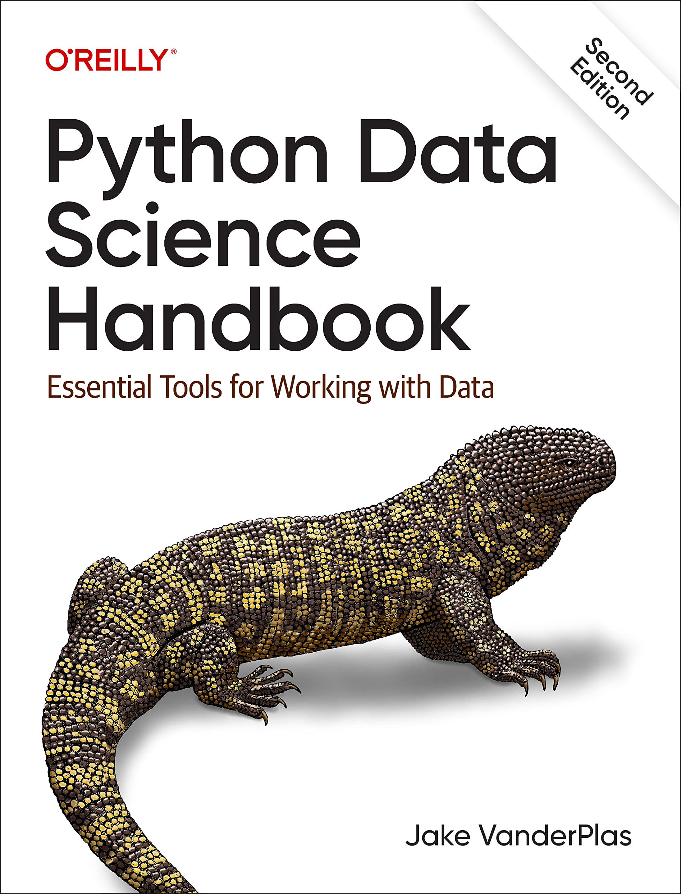
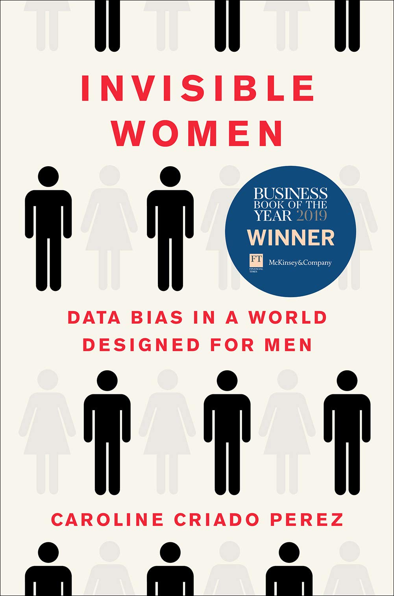
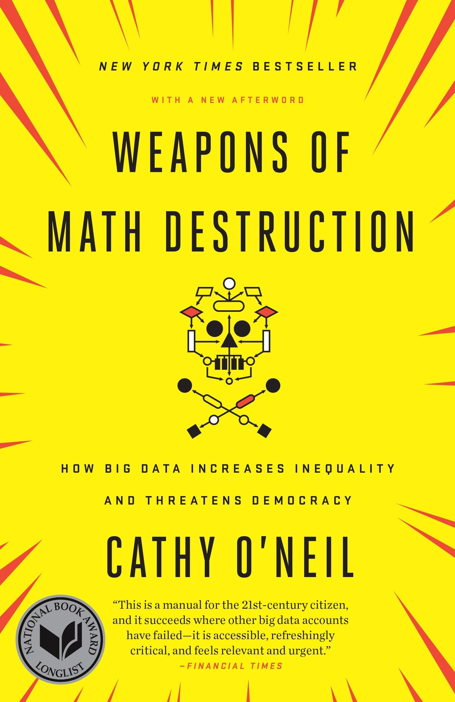

## Books

::: {.book-entry}

::: {.book-text}

### Python Data Science Handbook

Jake VanderPlas

This book teaches me things.

[Find this book (first edition) at the MacOdrum Library](https://ocul-crl.primo.exlibrisgroup.com/permalink/01OCUL_CRL/1jui968/alma991022762546905153)

:::
:::

::: {.book-entry}

::: {.book-text}

### Invisible Women: Data Bias in a World Designed for Men

Caroline Criado Perez

This book explores the gender data gap.

[Find this book at the MacOdrum Library](https://ocul-crl.primo.exlibrisgroup.com/permalink/01OCUL_CRL/1jui968/alma991022821319705153)

:::
:::

::: {.book-entry}

::: {.book-text}

### Weapons of Math Destruction

Cathy O'Neil

This book explores weapons of math destruction.

[Find this book at the MacOdrum Library](https://ocul-crl.primo.exlibrisgroup.com/permalink/01OCUL_CRL/1jui968/alma991022959533205153)

:::
:::

## Articles 

## Papers

## Podcasts